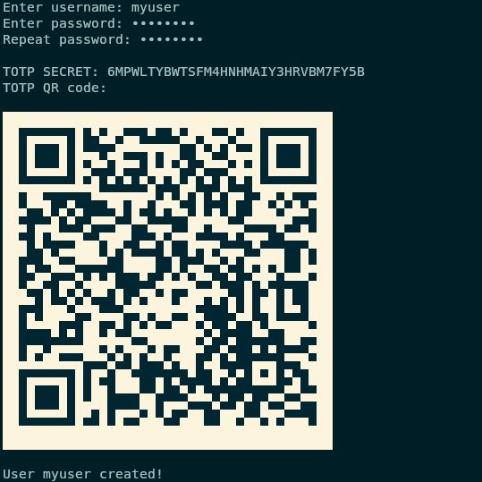

# rotproxy

A Rust (T)OTP (authentication) Proxy - rotproxy!

rotproxy is a simple authentication proxy with a command line interface to enroll users and a webpage for multi-factor authentication using TOTP.  
rotproxy aims to be a simple and small program to protect your webpages & applications when you don't need an IdP or fancy features but want good security.  
The killer feature is the ability to use magic routing and rotating hashes to hide the login page using another layer of security (a shared secret), see the documentation for more information.




### Installation

Debian packages for `amd64` and `arm64` are provided under releases.
Files and configuration are by default installed to `/etc/rotproxy`, a hardened systemd service file is also installed and enabled.

### Building

```
rustup update stable
git clone https://github.com/farfalleflickan/rotproxy
cd rotproxy
cargo build
cargo run
```

### Usage

```
Usage:
	-c | --config /path/to/config.toml	Specify path to config file
	-h | --help				Prints this help
	-i | --interface ip			ip to bind to
	-p | --port port			port to bind to
	-u | --users /path/to/db.json		users database
	-w | --webpage /path/to/index.html	html login page to serve
	add-user				Create a new user
	delete-user				Delete a user
	edit-user				Edit a user
	list-users				List all users
	init-conf				Prints default toml config
	gen-cookie				Provides a new cookie key
```


### Documentation

* [rotproxy configuration](docs/config.md)  
* [web proxy configuration](docs/webproxy.md)  
* [service configuration](docs/service.md)